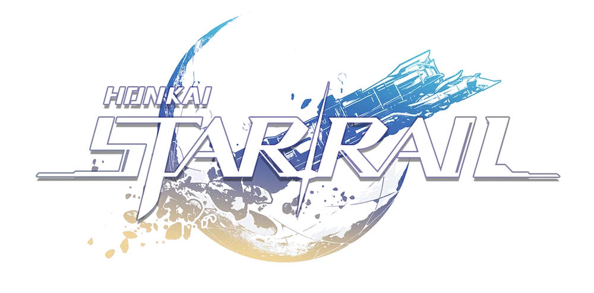
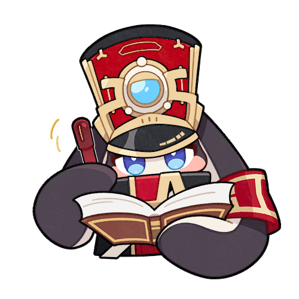

# Honkai: Star Rail Wiki

This project is a fan wiki for the turn-based gacha game [Honkai: Star Rail](https://hsr.hoyoverse.com/en-us/). It features a database containing the characters and equipment for players to view, and a character build editor, which allows users to share their builds with other players and to receive feedback through a Like system. This can be helpful for players who are looking for tips on how to build their characters or who want to see what other players are doing.

# Project ERD

# Trailblazer-API
The main feature of this API is the build creator which uses the content in the database to allow users to create character builds. This provides users with options which reflects how character builds are done in-game, specifically:

    Characters
    Lightcones
    Relics
    Ornaments

Users can then select the options that they want to include in their build, and the build creator will generate a character sheet that includes all of the selected options. The build creator also allows users to save their builds, so that they can access them later.

