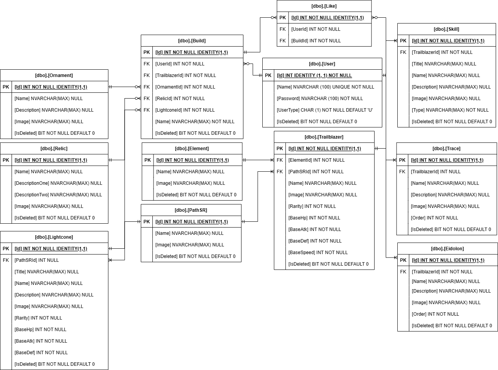

# Honkai: Star Rail Wiki

This project is a fan wiki for the turn-based gacha game [Honkai: Star Rail](https://hsr.hoyoverse.com/en-us/). It features a database containing the characters and equipment for players to view, and a character build editor, which allows users to share their builds with other players and to receive feedback through a Like system. This can be helpful for players who are looking for tips on how to build their characters or who want to see what other players are doing.

# Project ERD

# Trailblazer-API
The main feature of this API is the build creator which uses the content in the database to allow users to create character builds. This provides users with options which reflects how character builds are done in-game, specifically:

    Characters
    Lightcones
    Relics
    Ornaments

Users can then select the options that they want to include in their build, and the build creator will generate a character sheet that includes all of the selected options. The build creator also allows users to save their builds, so that they can access them later.

# Endpoints
## Builds
### POST /api/builds
Creates a new character build
### POST /api/builds/{buildId}/like
Likes a build
### POST /api/builds/{buildId}/unlike
Removes a like from a build
### GET /api/builds
Gets all builds in the database
### PUT /api/builds
Updates an existing build by it's ID
### DELETE /api/builds/{id}
Deletes an existing build from the database by it's ID

## Eidolons
### POST /api/eidolons
Creates a new eidolon
### GET /api/eidolons
Gets all eidolons in the database
### GET /api/eidolons/{id}
Gets an eidolon in the database by it's ID
### PUT /api/eidolons
Updates an existing eidolon by it's ID
### DELETE /api/eidolons/{id}
Deletes an existing eidolon from the database by it's ID

## Elements
### POST /api/elements
Creates a new element
### GET /api/elements
Gets all elements in the database
### GET /api/elements/{id}
Gets an element in the database by it's ID
### PUT /api/elements
Updates an existing element by it's ID
### DELETE /api/elements/{id}
Deletes an existing element from the database by it's ID

## Lightcones
### POST /api/lightcones
Creates a new lightcone
### GET /api/lightcones
Gets all lightcones in the database
### GET /api/lightcones/{id}
Gets an lightcone in the database by it's ID
### PUT /api/lightcones
Updates an existing lightcone by it's ID
### DELETE /api/lightcone/{id}
Deletes an existing lightcone from the database by it's ID

## Ornaments
### POST /api/ornaments
Creates a new ornament
### GET /api/ornaments
Gets all ornaments in the database
### GET /api/ornaments/{id}
Gets an ornament in the database by it's ID
### PUT /api/ornaments
Updates an existing ornament by it's ID
### DELETE /api/ornaments/{id}
Deletes an existing ornament from the database by it's ID

## Paths
### POST /api/paths
Creates a new path
### GET /api/paths
Gets all paths in the database
### GET /api/paths/{id}
Gets an path in the database by it's ID
### PUT /api/paths
Updates an existing path by it's ID
### DELETE /api/paths/{id}
Deletes an existing path from the database by it's ID

## Relics
### POST /api/relics
Creates a new relic
### GET /api/relics
Gets all relics in the database
### GET /api/relics/{id}
Gets an relic in the database by it's ID
### PUT /api/relics
Updates an existing relic by it's ID
### DELETE /api/relics/{id}
Deletes an existing relic from the database by it's ID

## Skills
### POST /api/skills
Creates a new skill
### GET /api/skills
Gets all skills in the database
### GET /api/skills/{id}
Gets an skill in the database by it's ID
### PUT /api/skills
Updates an existing skill by it's ID
### DELETE /api/skills/{id}
Deletes an existing skill from the database by it's ID

## Traces
### POST /api/traces
Creates a new trace
### GET /api/traces
Gets all traces in the database
### GET /api/traces/{id}
Gets an trace in the database by it's ID
### PUT /api/traces
Updates an existing trace by it's ID
### DELETE /api/traces/{id}
Deletes an existing trace from the database by it's ID

## Trailblazers
### POST /api/trailblazers
Creates a new trailblazer
### GET /api/trailblazers
Gets all trailblazers in the database
### GET /api/trailblazers/{id}
Gets an trailblazer in the database by it's ID
### PUT /api/trailblazers
Updates an existing trailblazer by it's ID

## Users
### POST /api/users/login
Authenticates the user and generates a login token
### POST /api/users/signup
Creates a new user
### GET /api/users
Gets all users in the database
### GET /api/users/{id}
Gets an skill in the database by their ID
### PUT /api/users
Updates an existing skill by their ID
### DELETE /api/users/{name}
Deletes an existing skill from the database by their name